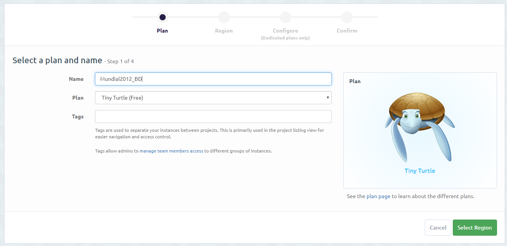
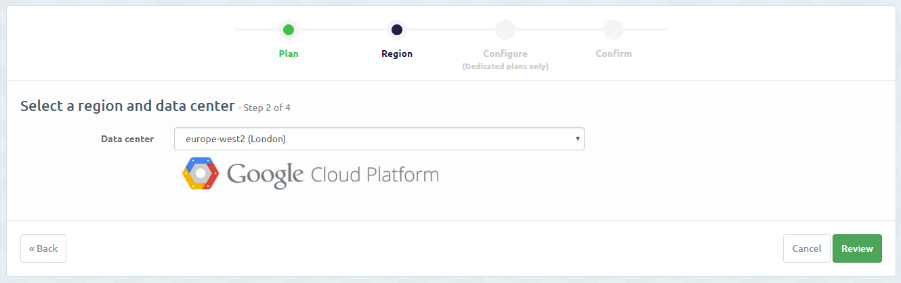
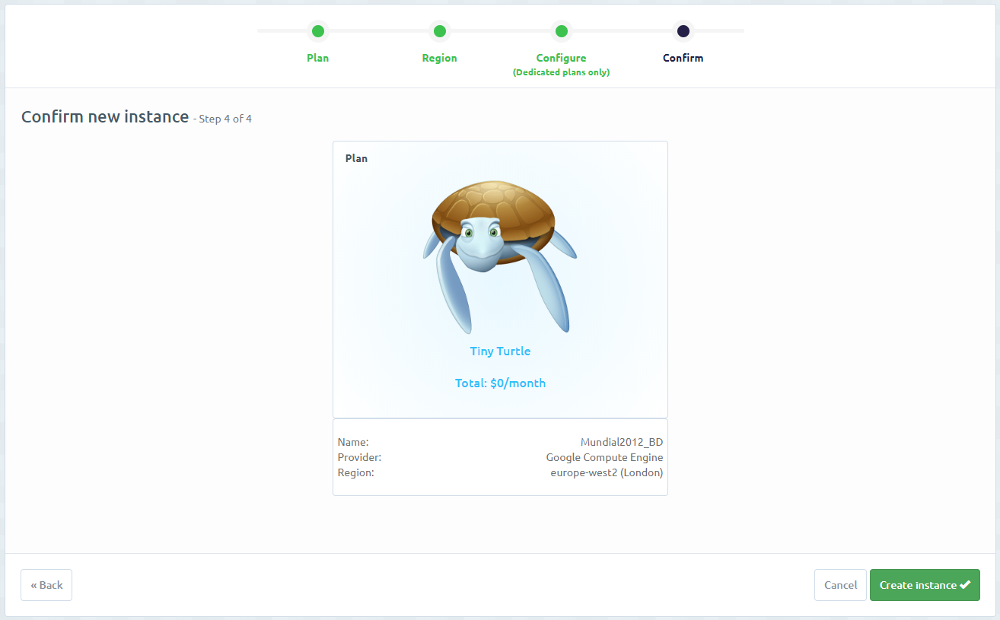
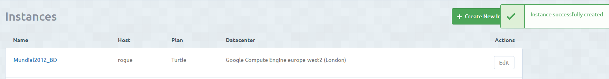

<h1>Nueva Instancia</h1>
Una vez iniciada sesión aparecemos en esta pantalla: 
--Añadir foto-- 
A continuación le damos a <i>+Create New Instance</i>. 
Apareceremos en la siguiente pantalla y debemos rellenar los datos que nos piden. 
Añadir nombre de la instancia. 
Añadir plan de la instancia. 
Añadir tags de la instancia(opcional). 

Una vez rellenado esto, le damos al botón verde que pone <i>Select Region</i>. 
Escogemos la region que queremos. 

Le damos a <i>Review</i>. 
Revisamos que todo esté bien y le damos a <i>Create instance</i>.

Apareceremos en la ventana del principio de todo con la instancia ya creada.

