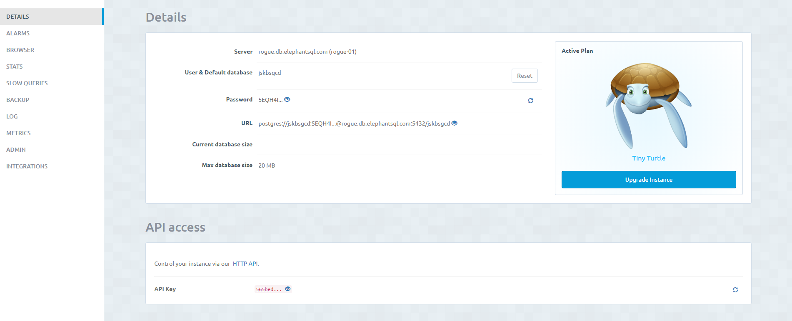
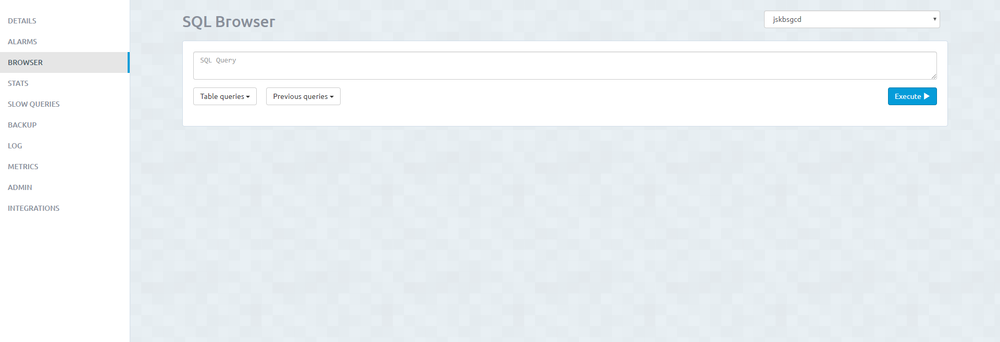
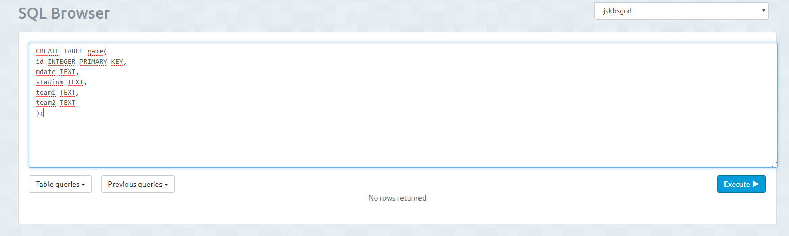
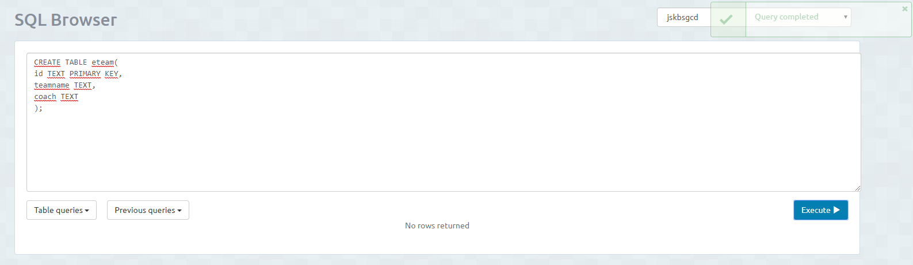

<h1>Creacion de Tablas</h1>
1º Entramos en la instancia creada. 

2º Vamos a la pestaña de <i>BROWSER</i> y ahí es donde creamos la tabla. 

<h2>Sintaxis para crear tabla</h2>
CREATE TABLE "nombre_tabla"( 
"columna 1" "tipo_de_datos_para_columna_1", 
"columna 2" "tipo_de_datos_para_columna_2", 
...  
); 

