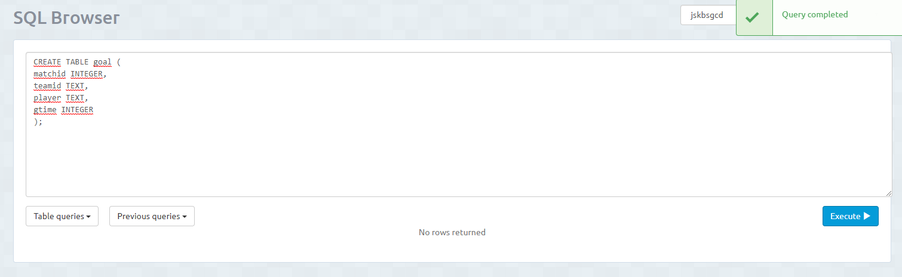

<h1>Creacion de Tablas</h1>
1º Entramos en la instancia creada. 

2º Vamos a la pestaña de <i>BROWSER</i> y ahí es donde creamos la tabla. 

<h2>Sintaxis para crear tabla</h2>
CREATE TABLE "nombre_tabla"( 
"columna 1" "tipo_de_datos_para_columna_1", 
"columna 2" "tipo_de_datos_para_columna_2", 
...  
); 
<h3><b>EJEMPLOS</b></h3>

<h2>Claves Primarias</h2>
Hay dos formas de hacerlo, hacerlo despues de crear las tablas o mientras la creas (Yo prefiero de esta segunda forma). 
<h4><b>Primera forma</b></h4>
Debemos escribir lo siguiente: 
ALTER TABLE "nombre_tabla" ADD PRIMARY KEY ("columna");

<h4><b>Segunda forma</b></h4>
Cuando estamos creando la tabla es cuando se pone la clave primaria. 
Para ello hay que escribir al lado del tipo de dato <i>PRIMARY KEY</i> 

<h2>Claves Ajenas</h2>
Hay dos formas de hacerlo, hacerlo mientras creas la tabla o despues de crearlas (Yo prefiero de esta segunda forma). 
<h4><b>Primera forma</b></h4>
Mientras creamos la tabla debemos poner: 
REFERENCES "nombre_tabla" ("columna") 

<b>IMPORTANTE: Debemos crear las tablas de forma ordenada para que funcione.</b>
<h4><b>Segunda forma</b></h4>
Despues de crear todas las tablas debemos escribir lo siguiente:
ALTER TABLE "nombre_tabla" 
ADD FOREIGN KEY ("columna") REFERENCES "nombre_tabla" ("columna"); 

