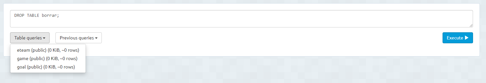

<h1>Borrar Tablas</h1>
En el caso de necesitar eliminar una tabla, debemos escribir lo siguiente: 
DROP TABLE "nombre_tabla"; 
<b>Ejemplo</b>
Para este ejemplo he creado una tabla llamada borrar.

Despues de ejecutar esto, podemos ver que la tabla ha sido eliminado.

