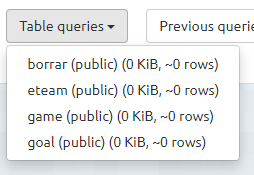
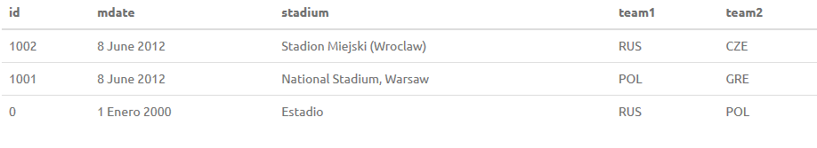
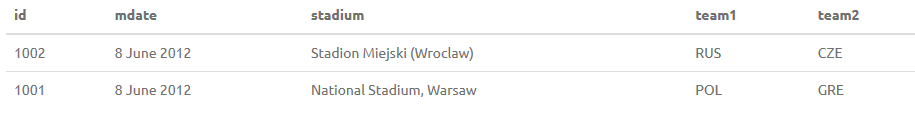

<h1>Borrar Tablas</h1>
En el caso de necesitar eliminar una tabla, debemos escribir lo siguiente: 
DROP TABLE "nombre_tabla"; 
<b>Ejemplo</b>
Para este ejemplo he creado una tabla llamada borrar.

Despues de ejecutar esto, podemos ver que la tabla ha sido eliminada.

<h2>Borrar datos de la tabla</h2>
Si lo que queremos es simplemente borrar todos los datos de la tabla, no hace falta borrar la tabla y volverla a crear. Podemos usar lo siguiente: 
TRUNCATE TABLE "nombre_tabla"; 
He vuelto a crear la tabla borrar y le he puesto valores.

