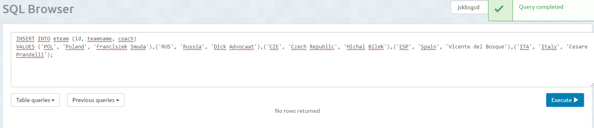
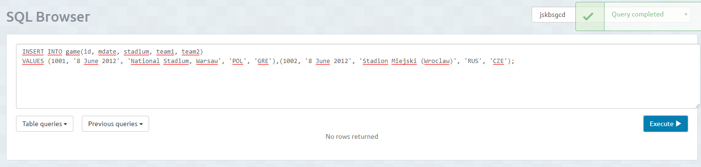
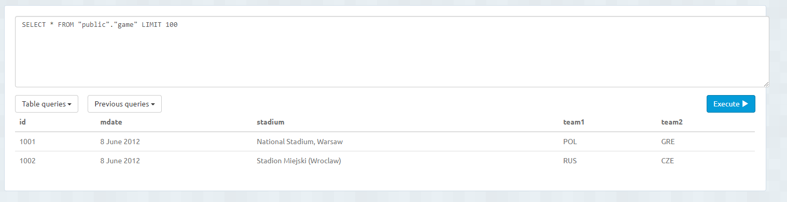

<h1>Insertar Datos</h1>
Para insertar datos en las tablas debemos escribir lo siguiente: 
INSERT INTO "nombre_tabla" ("columna1", "columna2", ...) 
VALUES ("valor1", "valor2", ...); 
<b>DATO IMPORTANTE: DEBEMOS TENER BIEN CREADAS LAS TABLAS, CON LAS CLAVES AJENAS PUESTAS. SINO PUEDE DAR ERROR</b> 
<b>TAMBIÉN DEBEMOS INSERTAR DATOS EN ORDEN DEPENDIENDO DE LAS CLAVES AJENAS</b> 
Ejemplo: 
1º Insertamos datos de la table eteam. 

2º Aquí vemos los datos de la tabla. 

3º Introducimos datos de la tabla game. En esta tabla necesitamos las claves principales de la tabla eteam, por eso imtroducimos despues estos datos. 

Y por último vemos los datos de esta tabla.

