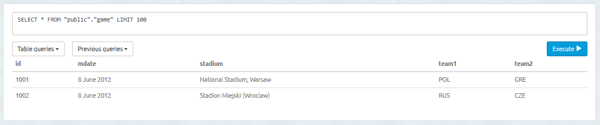
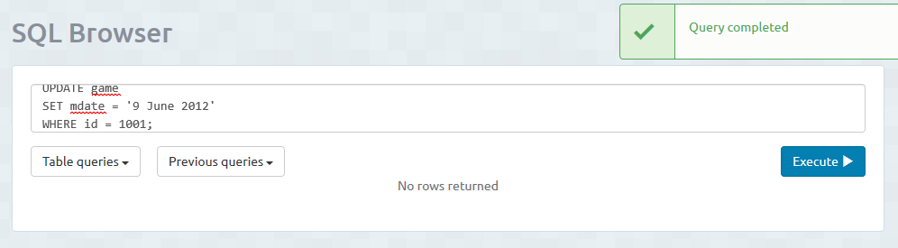
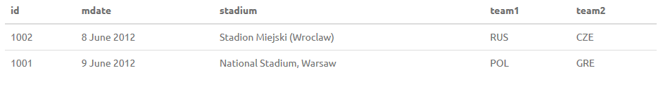
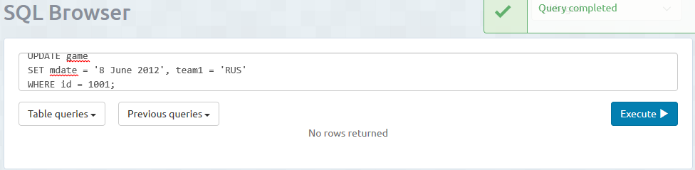
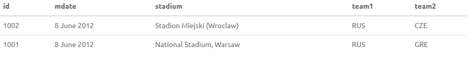

<h1>Modificar Datos</h1>
Una vez que tengamos datos insertados en las tablas, para modificar esos datos, debemos usar UPDATE. 
La sintaxis sería la siguiente: 
UPDATE "nombre_tabla" 
SET "culmna 1" = [valor1] 
WHERE "condición"; 
Usamos el where para saber en que tupla (fila) debemos modifcar el dato. Si varias filas cumple la condición, entonces se cambiará en todas ellas. 
También podemos modificar varios datos de una tupla. Para ello en el SET añadiriamos mas datos seperados por comas: 
Ejemplo: 
Tenemos esta tabla: 

Modificamos un solo dato. 

Despues de modificar, la tabla queda así: 

Volvemos a modificar pero esta vez modificamos dos datos a la vez. 

La tabla quedaría así: 

