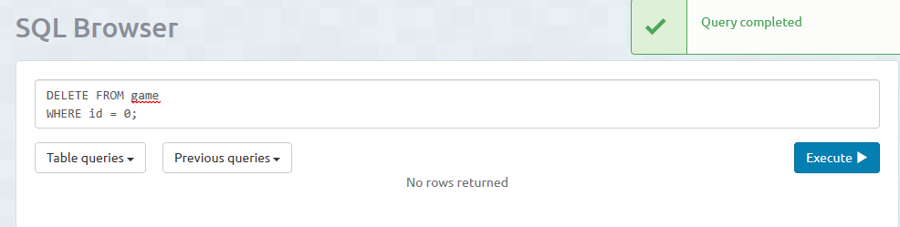

<h1>Eliminar Datos</h1>
Para eliminar una tupla (fila) de una tabla, debemos usar DELETE FROM. 
La sintaxis es de la siguiente manera: 
DELETE FROM "nombre_tabla" 
WHERE "condición"; 
Se borrará la tupla que cumpla la condición, si la cumplen mas de una ocurrirá como cuando modificamos los datos, en este caso se borrarían las tuplas que la cumplan; 
Ejemplo: 
He creado una nueva tupla para borrar. La tabla estaría así:

Borramos la tupla con id 0.

La tabla queda así:

