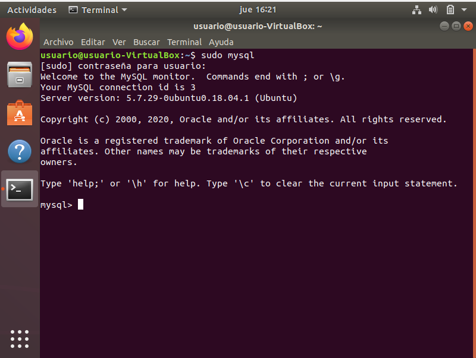

<h1>Instalacion XSBD en local</h1>
Para realizar la instalción del xsbd en local, debemos escribir en el terminal lo siguiente: 
1º Actulizaremos los paquetes disponibles con: <b>sudo apt update</b> 
2º Instalaremos el paquete con el MySQL: <b>sudo apt install mysql-server</b> 
3º Una vez acabo la instalación, ya podemos usarlo y para ello debemos poner lo siguiente antes de empezar: <b>sudo mysql</b> 

